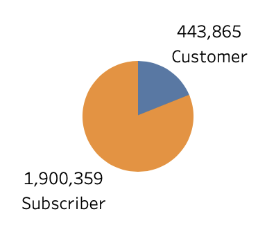
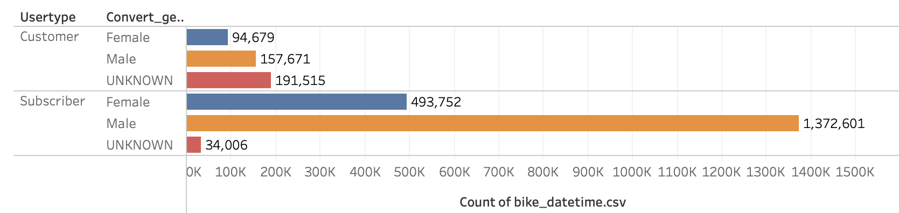
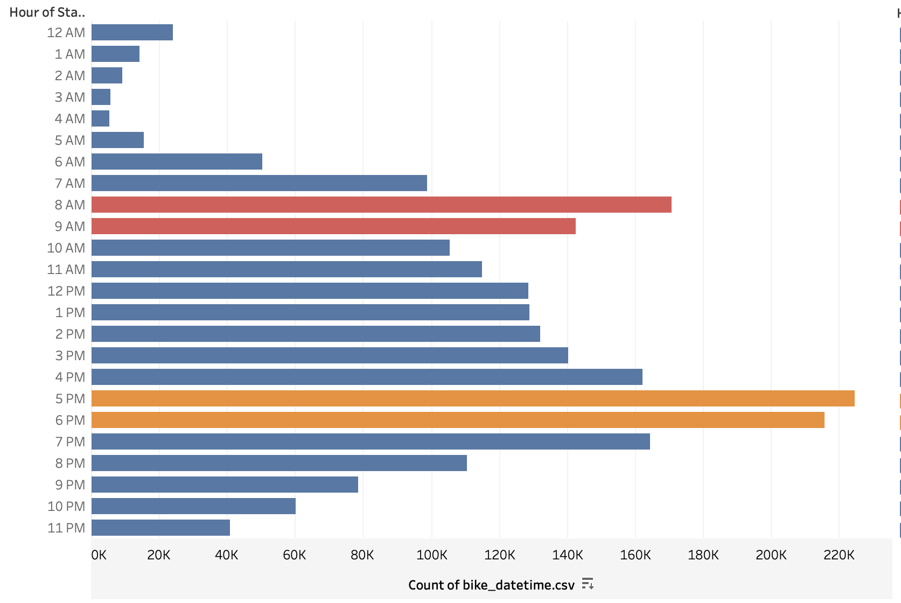
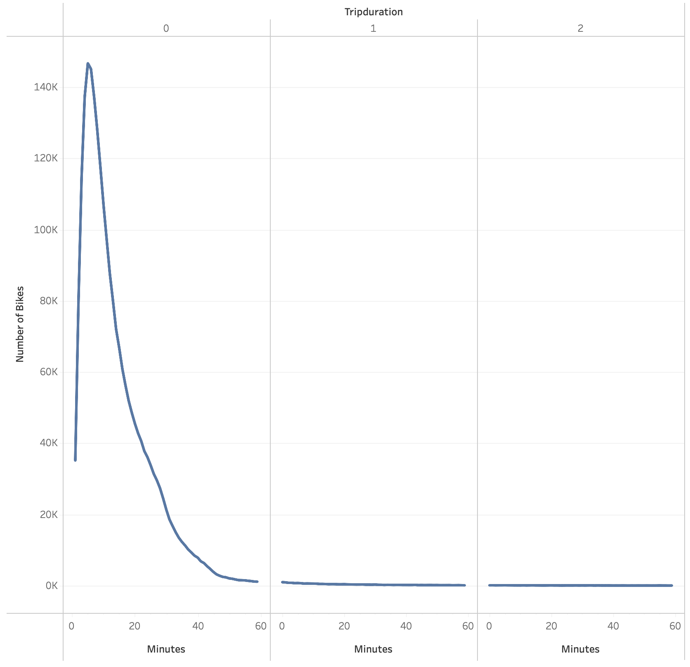
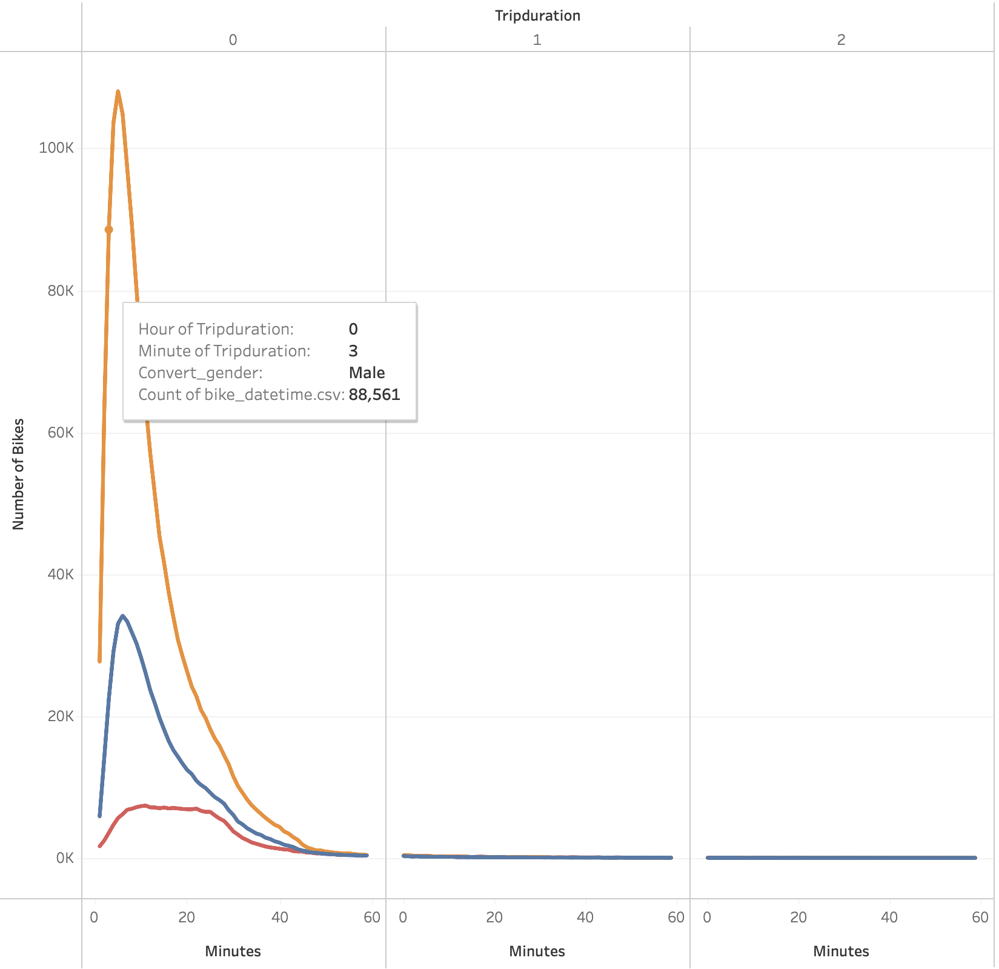
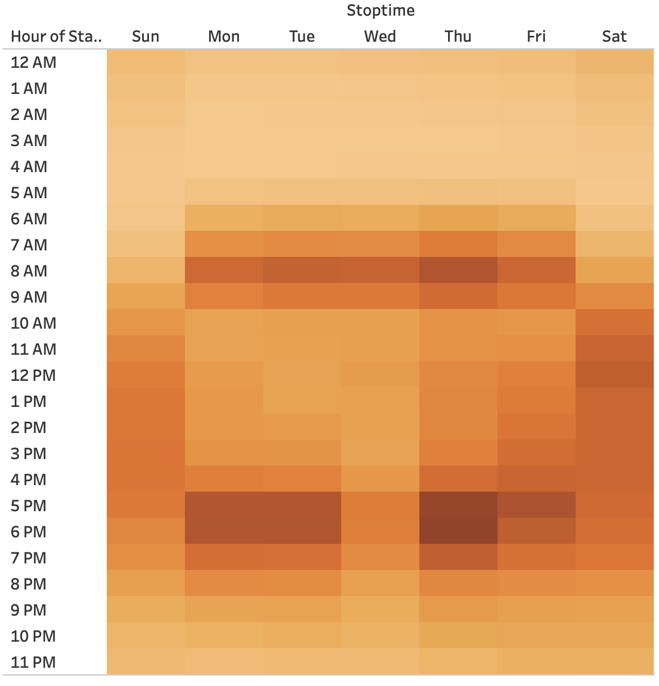
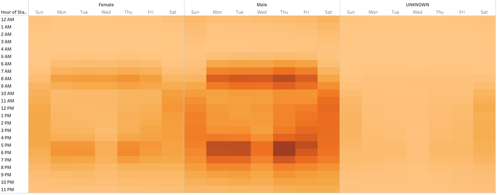
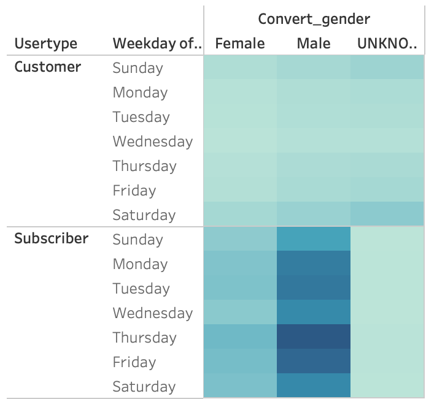

# BikeSharing
## Overview 
In this project we used tableau to create multiple graphs and charts from data collected from Citibike, a bicycle sharing company, in New York city. 

### Purpose 
The purpose of this project is to provide visualizations of how the bike sharing business works in New York City in order to find patterns and make predictions for starting a bikesharing business in a different city. These visualizations would be used to present the data in a clear concise manner for investors. 

## Results 
### Customer Types

Majority of users for New York City are subscribers rather than one time use customers.
### Users by Gender

In subscriptions male users are the by far the majority of consumers with 1,372,601 rides while in one time use customers all three groups are about even with unknown having the most rides.
### August Peak Hours

There are two peak times throughout the day one from 8am to 9am and the other from 5pm to 6pm.
### Checkout Time for Users

The majority of rides have a duration less than 20 minutes.
### Checkout Time by Gender

The majority of rides last less than 20 minutes for all gender categories male female and unknown.
### Trips by Weekday for Each Hour

The busiest hour throughout the week is 5pm and the busiest day is Saturday.
### Trips by Gender (Weekday per Hour)

Males have a strong trip to time correlation at times 8am and 5pm. Females have the same correlation but not as strong. Unknown does not appear to have any time of use correlation 
### User Trips by Gender by Weekday

One-time use customers have weak correlation between weekdays and gender. Subscribers are mostly male with their busiest day being Thursday. Very few unknown get subscriptions.

## Summary 
In conclusion we can see that the majority of the clientele will be subscription driven with males as the most common consumer. The weekday by hour graphs used with the August peak times graph show a strong correlation that daily commuters are the bulk of the users. These peak times of 8am and 5pm match up with the typical 9 to 5 work day schedule where commuters travel to work the hour before 9am and travel home after 5pm. An additional visualization that would provide further insight would be one of the most used starting and ending locations to further analyze where people are traveling. Another visualization could be for how long do users stay subscribed for. 

[link to dashboard](https://public.tableau.com/views/Challenge14Story_16531744461060/Story1?:language=en-US&publish=yes&:display_count=n&:origin=viz_share_link)